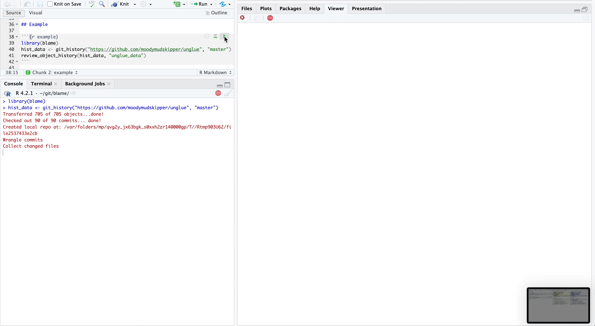

<!-- README.md is generated from README.Rmd. Please edit that file -->

```{r, include = FALSE}
knitr::opts_chunk$set(
  collapse = TRUE,
  comment = "#>",
  fig.path = "man/figures/README-",
  out.width = "100%"
)
```

# blame

Experimental! 

Semantic version control for R

We can track the evolution of specific objects and their doc through commits.

Very unstable at the moment, every function and args might have changed names next time you install.

The name comes from "git blame", since this is a somewhat similar feature.

## Installation

Install with:

``` r
remotes::install_github("moodymudskipper/blame")
```

## Example

```{r example, eval = FALSE}
library(blame)
hist_data <- git_history("https://github.com/moodymudskipper/unglue")
#> Transferred 705 of 705 objects...done!
#> Checked out 90 of 90 commits... done!
#> Created local repo at: /var/folders/mp/qvg2y_jx63bgk_s0xxh2zr140000gp/T//Rtmp903U62/file2531910b7ea
#> Wrangle commits
#> Collect changed files
#> Parse files
review_object_history(hist_data, "unglue_data")
```



* The `git_history()` command above fetches the history of the branch at the object
level, it takes a couple seconds to run here but for a big repo
like "https://github.com/tidyverse/dplyr" it will take a few minutes
* We can provide a branch, by default the main one is used (whatever is its name)
* `review_object_history()` takes a function name so we can explore its history,
 `ascending = TRUE` by default, set it to `FALSE` to go from most to least recent
