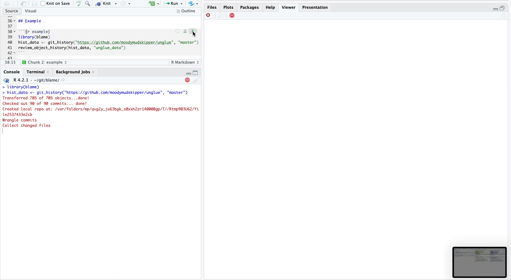

<!-- README.md is generated from README.Rmd. Please edit that file -->

# blame

Experimental!

Semantic version control for R

We can track the evolution of specific objects and their doc through
commits.

Very unstable at the moment, every function and args might have changed
names next time you install.

The name comes from “git blame”, since this is a somewhat similar
feature.

## Installation

Install with:

``` r
remotes::install_github("moodymudskipper/blame")
```

## Example

``` r
library(blame)
hist_data <- git_history("https://github.com/moodymudskipper/unglue", "master")
#> Transferred 705 of 705 objects...done!
#> Checked out 90 of 90 commits... done!
#> Created local repo at: /var/folders/mp/qvg2y_jx63bgk_s0xxh2zr140000gp/T//Rtmp903U62/file2531910b7ea
#> Wrangle commits
#> Collect changed files
#> Parse files
review_object_history(hist_data, "unglue_data")
```



- The `git_history()` command above fetches the history of the branch at
  the object level, it takes a couple seconds to run here but for a big
  repo like “<https://github.com/tidyverse/dplyr>” it will take a few
  minutes
- The default `branch` is “main”, for this example we need to specify
  “master”.
- `review_object_history()` takes a function name so we can explore its
  history, `ascending = TRUE` by default, set it to `FALSE` to go from
  most to least recent
